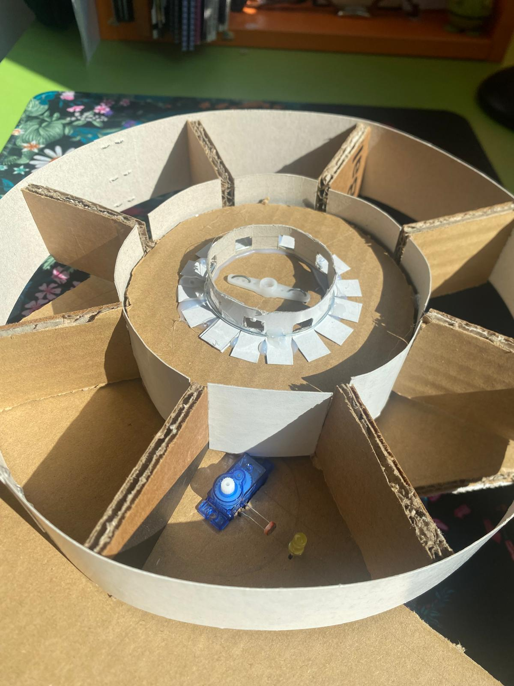
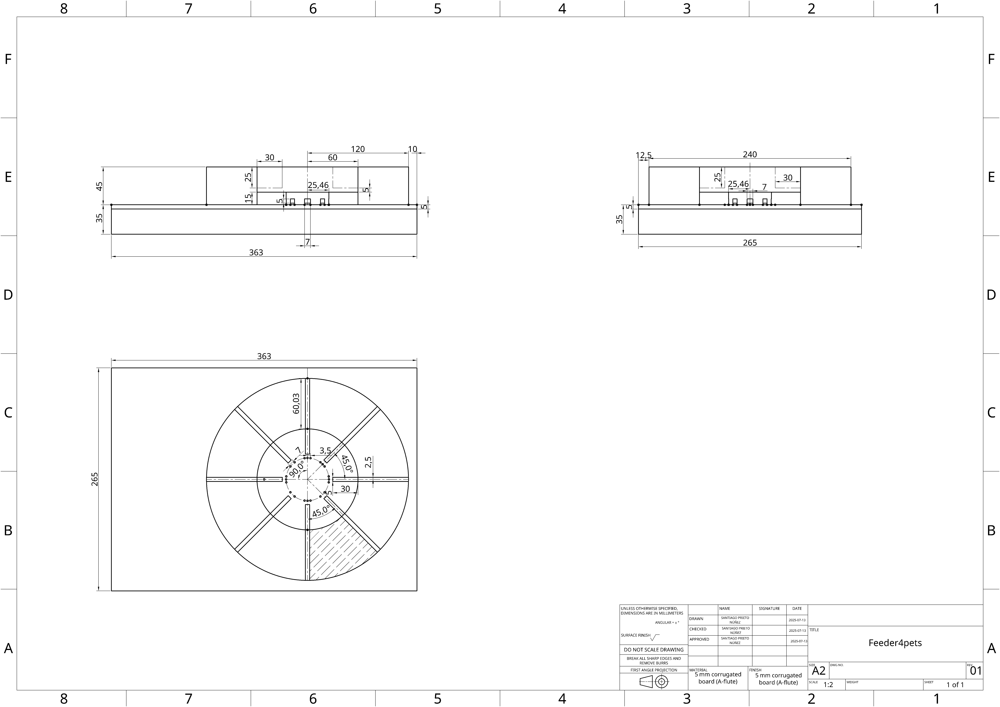
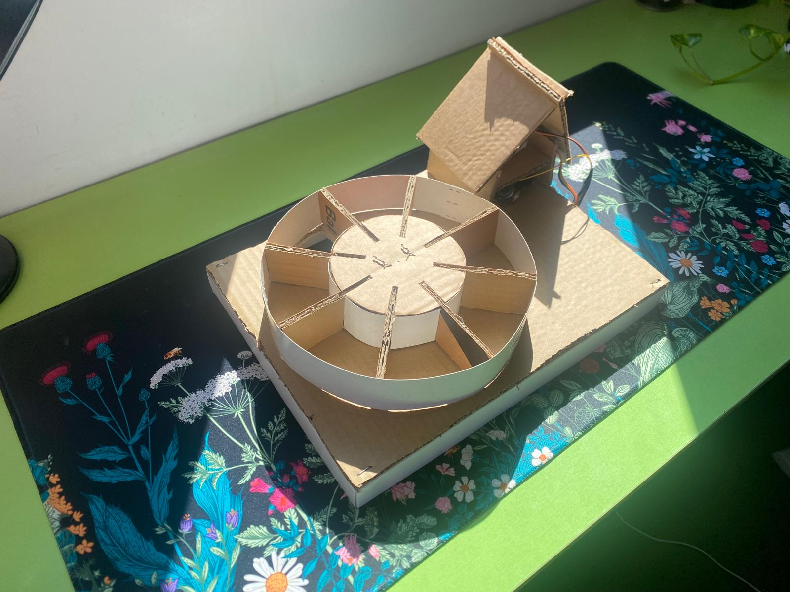
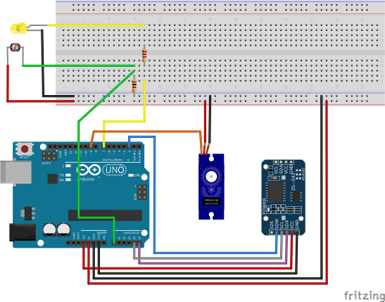

# Feeder4pets
I created an automated feeder for a rabbit 😁 

## Why? You may ask 😱
Well, long story short, y have to take care of a rabbit for July, and to avoid go to the house where the rabbit is in (Yes, I'm that lazy 😅), I developed a simple proyect to make a dispenser for the pet food with only cardboard and my old [Arduino Uno](https://store.arduino.cc/products/arduino-uno-rev3?srsltid=AfmBOorJnbd139dxaxaAQkf2PpH3Emm7-MJmiFvstXOTHKIlZhMDNLmq) microcontroller from school days.

If you're in a similar position to mine or enjoy automating things like I do 😁, I'll walk you through the process for some ideas!

## 🐢🔨 The hardware 
This simple project could escalate very quickly into a more complex project if you can't select proper hardware for the application. I searched for some ideas online, and I developed my idea, so simple that I couldn't make it fail. The concept is:

### 🎡 The MILL 
With this approach, I only need to make a horizontal "_mill_" with 8 mill blades that will push the food around, and add a hole between two of them. One day of food 1/8 rotation of the mill, easy isn't it?.

Well, the **BIG PROBLEM** wasn't making it rotate, was **how to make it rotate exactly 1/8 of the perimeter**, you can do that with big servomotors with feedback, I have a humble servo [SG90 360º](https://www.micro-semiconductor.fr/datasheet/b6-SER0043.pdf) and it can't control position. So I developed an encoder for the "_mill_" similar to the [encoders of the mouse wheels](https://en.wikipedia.org/wiki/Rotary_encoder), using a photoresistor, a cardboard piece pierced, and a LED as you can see in the image below, the servomotor and the encoder electronics are between one of the "_mill_" blades. Also, you can see the encoder attached to the bottom of the "_mill_".

<p align="center">
  
</p>

Finally, I prepared some drawings that I created on the marvelous platform [OneShape](https://www.onshape.com/en/) where you can [edit my drawing](https://cad.onshape.com/documents/982dc77cace2c5df638cb5e2/w/1ef73fe32f59e030ae584a7b/e/b6536aec28525660e01a2584) to be more detailed with the measures, as you can see below, and included them in the "blueprint" directory.

<p align="center">
  
</p>

For some clarity, here you have a general point of view of the final result.

<p align="center">
  
</p>

### 📎 Circuit
I use the Arduino Uno R3 microcontroller, for the encoder as I said I use a photoresistor and a LED, for the rotation a servo, and finally to keep the time an RTC. The full list is:
- [Arduino Uno R3 microcontroller](https://store.arduino.cc/products/arduino-uno-rev3?srsltid=AfmBOorJnbd139dxaxaAQkf2PpH3Emm7-MJmiFvstXOTHKIlZhMDNLmq) - 29'30 €.
- [LDR fotoresistor](https://www.luisllamas.es/en/measure-light-level-arduino-ldr-photoresistor/) - 0'35€.
- [LED](https://learn.adafruit.com/all-about-leds/the-led-datasheet) (Yellow) - 0'16€.
- [Servo 360º](https://www.electrocomponentes.es/motores-y-servos/931-servo-mini-sg90-9g-micro-360-motor-paso-a-paso-giro-continuo.html) - 0'99€.
- [RTC3231](https://es.aliexpress.com/item/1005006127416923.html?src=google&pdp_npi=4%40dis!EUR!4.25!1.49!!!!!%40!12000035879185769!ppc!!!&snpsid=1&snps=y&snpsid=1&src=google&albch=shopping&acnt=439-079-4345&isdl=y&slnk=&plac=&mtctp=&albbt=Google_7_shopping&aff_platform=google&aff_short_key=UneMJZVf&gclsrc=aw.ds&&albagn=888888&&ds_e_adid=&ds_e_matchtype=&ds_e_device=c&ds_e_network=x&ds_e_product_group_id=&ds_e_product_id=es1005006127416923&ds_e_product_merchant_id=5551326180&ds_e_product_country=ES&ds_e_product_language=es&ds_e_product_channel=online&ds_e_product_store_id=&ds_url_v=2&albcp=20007147547&albag=&isSmbAutoCall=false&needSmbHouyi=false&gad_source=1&gad_campaignid=19998877869&gbraid=0AAAAACbpfvZNW1XJTN-0dUVVNRU8wRm1T&gclid=CjwKCAjwyb3DBhBlEiwAqZLe5OO42gJm4CRIlCElcgCkL_AS93jTn0qfm2HM43VHM9N_4EgJj30E_RoCvFsQAvD_BwE) - 1'49€.
- [bunch of cables, resistors and a protoboard](https://solectroshop.com/es/placas-de-pruebas-protoboard/256-placa-prototipo-protoboard-breadboard-400-puntos-arduino-5905323238381.html?srsltid=AfmBOorbpLdx1sRy4ew9aUN4s4LWh7R0Y5SuwKCbuFp5khx8BQtBL-sKNPI) 2'00€

For a total of less than 35€, you can make yourself a dispenser with a simple circuit:
<p align="center">
  
</p>

## ✒️ Software
This application is straightforward in terms of software. Only needs to create interruptions using the RTC module, and then move the "_mill_" reading of the photoresistor to the next hole in the encoder. To do this, the library "[_RTClib_](https://docs.arduino.cc/libraries/rtclib/)" of Adafruit.

Also, I want to highlight another interesting feature of this application, which is the objective of saving the most energy to run the Arduino on an external power bank as long as possible. To do that, I use the library [_LowPower_](https://docs.arduino.cc/libraries/lowpower_lowpowerlab/) of LowPowerLab to use as little as ~9–13 mA.

To do this, we use the Low Power library like:
```cpp
#include <LowPower.h>

// ADC and BOD off because we use an external RTC to get the time
LowPower.powerDown(SLEEP_FOREVER, ADC_OFF, BOD_OFF);
```

The full code with the interruptions using the RTC can be seen in the main file "[_dispenser.ino_](https://github.com/sprieton/Feeder4pets/blob/main/dispenser.ino)"
